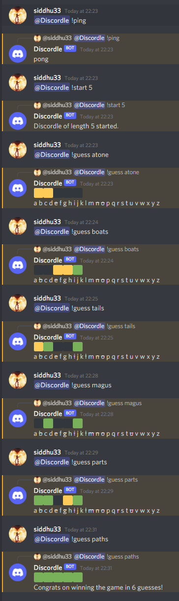

# discordle 


Discord Bot to play a wordle-like game with users.



---
## Requirements

- ### `npm` of some kind installed.
- ### `.env` file with discord token `DISCORD_TOKEN` populated.
---
## Installation
```shell
npm install -g yarn
yarn install
yarn start
```
---
## Commands

```d
@Discordle !ping
```
### Ping server to see if it is up.

```d
@Discordle !start [length]
```
### Start a game of length `length`. Will pick out a word from the corpus file, `corpus.txt`.

```d
@Discordle !state
```
### Get the current state of a game, if one is currently being played in the channel.

```d
@Discordle !guess [word]
```
### Guess the word described by `word`. Will increment the guesses counter
---
## NB - Many many thanks to the developer of [Wordle](https://www.powerlanguage.co.uk/wordle/) for inspiring this bot!